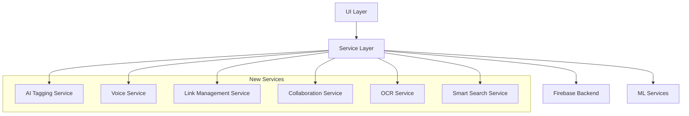

# Design Document - Advanced Features

## Overview

This design document outlines the architecture and implementation approach for advanced features that will transform NoteAssista into a comprehensive knowledge management system. The features include AI-powered organization, voice interaction, knowledge graph visualization, real-time collaboration, and rich content capture. The design maintains the existing clean architecture while introducing new services for ML processing, speech recognition, collaborative editing, and advanced visualization.

## Architecture

### High-Level Architecture



### Technology Stack

**AI & ML**
- TF-IDF algorithm for keyword extraction (dart package: `ml_algo`)
- On-device text analysis for privacy
- Firebase ML Kit for image processing

**Speech Recognition**
- `speech_to_text` package for voice input
- On-device recognition for offline support
- Cloud Speech-to-Text API for enhanced accuracy

**Collaboration**
- Firestore real-time listeners for live updates
- Operational Transform algorithm for conflict resolution
- Presence system using Firestore and Firebase Realtime Database

**Visualization**
- `flutter_force_directed_graph` for graph view
- Custom canvas painting for drawing support

**Storage & Media**
- Firebase Storage for audio files, images, and drawings
- Image compression using `flutter_image_compress`
- Audio compression using `flutter_sound`

**UI Components**
- `flutter_markdown` for markdown rendering with links
- `audioplayers` for audio playback
- `google_mlkit_text_recognition` for OCR
- `geolocator` for location-based reminders
- `flutter_local_notifications` for reminder notifications

## Components and Interfaces

### 1. AI Tagging Service

**Purpose**: Analyze note content and generate relevant tag suggestions

**Key Methods**:
```dart
class AITaggingService {
  // Analyze note content and return suggested tags
  Future<List<TagSuggestion>> generateTagSuggestions(String title, String description);
  
  // Learn from user's tag acceptance to improve suggestions
  Future<void> recordTagAcceptance(String tag, String noteContent);
  
  // Get user's tag usage history for personalization
  Future<Map<String, int>> getUserTagFrequency(String userId);
  
  // Extract keywords using TF-IDF
  List<String> extractKeywords(String text, int maxKeywords);
}

class TagSuggestion {
  final String tag;
  final double confidence;
  final String reason;
}
```

**Implementation Details**:
- Use TF-IDF to identify significant terms
- Remove stop words (the, is, at, etc.)
- Prioritize tags user has used before
- Store tag frequency in user profile
- Run analysis on device for privacy

### 2. Smart Search Service

**Purpose**: Parse natural language queries and perform intelligent search

**Key Methods**:
```dart
class SmartSearchService {
  // Parse natural language query and return structured search
  SearchQuery parseQuery(String naturalLanguageQuery);
  
  // Execute search with ranking
  Future<List<SearchResult>> search(String userId, SearchQuery query);
  
  // Extract temporal expressions (last week, yesterday, etc.)
  DateRange? extractDateRange(String query);
  
  // Extract search operators (tag:, date:, is:)
  Map<String, String> extractOperators(String query);
}

class SearchQuery {
  final List<String> keywords;
  final DateRange? dateRange;
  final List<String> tags;
  final Map<String, dynamic> filters;
}

class SearchResult {
  final NoteModel note;
  final double relevanceScore;
  final List<TextHighlight> highlights;
}
```

**Search Ranking Algorithm**:
1. Keyword frequency in title (weight: 3.0)
2. Keyword frequency in description (weight: 2.0)
3. Tag matches (weight: 2.5)
4. Recency bonus (weight: 1.0)
5. Pin status bonus (weight: 0.5)


### 3. Voice Service

**Purpose**: Handle speech-to-text conversion and audio recording

**Key Methods**:
```dart
class VoiceService {
  // Start listening for speech input
  Future<void> startListening(Function(String) onResult);
  
  // Stop listening and finalize transcription
  Future<String> stopListening();
  
  // Check if speech recognition is available
  Future<bool> isAvailable();
  
  // Record audio file for attachment
  Future<String> recordAudio(Duration maxDuration);
  
  // Upload audio to Firebase Storage
  Future<String> uploadAudio(String localPath, String userId, String noteId);
  
  // Get real-time transcription updates
  Stream<String> getTranscriptionStream();
}
```

**Implementation Details**:
- Use `speech_to_text` package
- Support continuous recognition up to 5 minutes
- Provide real-time transcription feedback
- Fall back to on-device recognition when offline
- Handle microphone permissions gracefully
- Apply noise cancellation settings

### 4. Link Management Service

**Purpose**: Parse, create, and manage note links and backlinks

**Key Methods**:
```dart
class LinkManagementService {
  // Parse note content for [[Note Title]] syntax
  List<NoteLink> parseLinks(String content);
  
  // Get all notes that link to a specific note (backlinks)
  Future<List<NoteModel>> getBacklinks(String userId, String noteId);
  
  // Update links when a note is renamed
  Future<void> updateLinksOnRename(String userId, String oldTitle, String newTitle);
  
  // Create a new note from a link
  Future<String> createNoteFromLink(String userId, String noteTitle);
  
  // Get autocomplete suggestions for note titles
  Future<List<String>> getNoteTitleSuggestions(String userId, String partial);
  
  // Build graph data structure for visualization
  Future<GraphData> buildNoteGraph(String userId);
}

class NoteLink {
  final String targetTitle;
  final String displayText;
  final int startIndex;
  final int endIndex;
  final bool exists; // Does target note exist?
}

class GraphData {
  final List<GraphNode> nodes;
  final List<GraphEdge> edges;
}
```

**Link Storage Strategy**:
- Store outgoing links as array in note document
- Compute backlinks dynamically via query
- Index notes by title for fast lookup
- Update all references when note renamed


### 5. Collaboration Service

**Purpose**: Enable real-time multi-user editing with presence and conflict resolution

**Key Methods**:
```dart
class CollaborationService {
  // Share a note with collaborators
  Future<void> shareNote(String noteId, List<String> collaboratorEmails);
  
  // Get list of active collaborators on a note
  Stream<List<Collaborator>> getActiveCollaborators(String noteId);
  
  // Update user's presence (viewing/editing)
  Future<void> updatePresence(String noteId, PresenceStatus status);
  
  // Broadcast cursor position to other users
  Future<void> broadcastCursorPosition(String noteId, int position);
  
  // Listen for remote changes
  Stream<NoteChange> listenForChanges(String noteId);
  
  // Apply operational transform for conflict resolution
  String applyOperationalTransform(String localText, List<Operation> remoteOps);
  
  // Send edit operation to other collaborators
  Future<void> broadcastOperation(String noteId, Operation op);
}

class Collaborator {
  final String userId;
  final String email;
  final String displayName;
  final Color cursorColor;
  final int? cursorPosition;
  final PresenceStatus status;
}

enum PresenceStatus { viewing, editing, away }

class Operation {
  final OperationType type;
  final int position;
  final String? text;
  final int? length;
  final DateTime timestamp;
  final String userId;
}

enum OperationType { insert, delete, retain }
```

**Operational Transform Algorithm**:
1. Each edit generates an operation (insert/delete)
2. Operations are timestamped and attributed to user
3. When concurrent edits occur, transform operations to maintain consistency
4. Apply transformed operations in causal order
5. Broadcast operations to all active collaborators

**Presence System**:
- Use Firebase Realtime Database for low-latency presence
- Update presence every 30 seconds
- Mark users as away after 2 minutes of inactivity
- Clean up presence data on disconnect


### 6. OCR Service

**Purpose**: Extract text from images using optical character recognition

**Key Methods**:
```dart
class OCRService {
  // Process image and extract text
  Future<OCRResult> extractTextFromImage(String imagePath);
  
  // Upload image to Firebase Storage
  Future<String> uploadImage(String localPath, String userId, String noteId);
  
  // Optimize image before OCR processing
  Future<String> optimizeImage(String imagePath);
  
  // Support multiple languages
  Future<OCRResult> extractTextWithLanguage(String imagePath, String languageCode);
}

class OCRResult {
  final String extractedText;
  final double confidence;
  final List<TextBlock> blocks;
}

class TextBlock {
  final String text;
  final Rect boundingBox;
  final double confidence;
}
```

**Implementation Details**:
- Use Google ML Kit Text Recognition
- Optimize image: resize, enhance contrast, denoise
- Support offline processing
- Handle multiple languages
- Provide confidence scores for accuracy

### 7. Reminder Service

**Purpose**: Manage time-based and location-based reminders

**Key Methods**:
```dart
class ReminderService {
  // Schedule a time-based reminder
  Future<void> scheduleTimeReminder(String noteId, DateTime triggerTime, {bool recurring = false});
  
  // Schedule a location-based reminder
  Future<void> scheduleLocationReminder(String noteId, LatLng location, double radiusMeters);
  
  // Cancel a reminder
  Future<void> cancelReminder(String reminderId);
  
  // Get all active reminders for user
  Future<List<Reminder>> getActiveReminders(String userId);
  
  // Parse natural language time expressions
  DateTime? parseNaturalLanguageTime(String expression);
  
  // Monitor location for geofence triggers
  Stream<LocationEvent> monitorLocation();
}

class Reminder {
  final String id;
  final String noteId;
  final ReminderType type;
  final DateTime? triggerTime;
  final LatLng? location;
  final double? radiusMeters;
  final bool recurring;
  final RecurrencePattern? pattern;
}

enum ReminderType { time, location }

class RecurrencePattern {
  final RecurrenceFrequency frequency;
  final int interval;
  final DateTime? endDate;
}

enum RecurrenceFrequency { daily, weekly, monthly }
```

**Natural Language Time Parsing**:
- "tomorrow" → next day at 9 AM
- "next Monday" → upcoming Monday at 9 AM
- "in 2 hours" → current time + 2 hours
- "next week" → 7 days from now at 9 AM


### 8. Web Clipper Service

**Purpose**: Extract and save web content to notes

**Key Methods**:
```dart
class WebClipperService {
  // Fetch and parse web page content
  Future<WebClipResult> clipWebPage(String url);
  
  // Extract main article content
  String extractMainContent(String html);
  
  // Convert HTML to markdown
  String htmlToMarkdown(String html);
  
  // Download and store featured image
  Future<String?> downloadFeaturedImage(String imageUrl, String userId);
}

class WebClipResult {
  final String title;
  final String content;
  final String sourceUrl;
  final String? featuredImageUrl;
  final DateTime clippedAt;
  final List<String> suggestedTags;
}
```

**Implementation Details**:
- Use `http` package to fetch web pages
- Parse HTML with `html` package
- Extract main content using readability algorithm
- Convert HTML to markdown for consistent formatting
- Handle authentication and paywalls gracefully
- Cache images locally before uploading

### 9. Drawing Service

**Purpose**: Handle drawing creation, editing, and URL loading functionality

**Key Methods**:
```dart
class DrawingService {
  // Load existing drawing from Firebase Storage URL
  Future<ui.Image?> loadDrawingFromUrl(String drawingUrl);
  
  // Cache drawing image locally for performance
  Future<void> cacheDrawingImage(String drawingUrl, ui.Image image);
  
  // Get cached drawing image if available
  Future<ui.Image?> getCachedDrawingImage(String drawingUrl);
  
  // Composite background image with new drawing paths
  Future<ui.Image> compositeDrawingLayers(ui.Image? backgroundImage, List<DrawingPath> paths);
  
  // Scale image to fit canvas while maintaining aspect ratio
  ui.Image scaleImageToCanvas(ui.Image image, Size canvasSize);
  
  // Validate drawing URL format and accessibility
  Future<bool> validateDrawingUrl(String url);
}

class DrawingLoadResult {
  final ui.Image? image;
  final bool success;
  final String? errorMessage;
  final Size originalSize;
}
```

**Implementation Details**:
- Use Firebase Storage SDK to download images
- Implement local caching using `path_provider` and device storage
- Handle network errors and invalid URLs gracefully
- Maintain original image aspect ratio during scaling
- Support different image formats (PNG, JPEG)
- Provide loading progress feedback

## Data Models

### Extended Note Model

```dart
class NoteModel {
  final String id;
  final String title;
  final String description;
  final String timestamp;
  final int categoryImageIndex;
  final bool isDone;
  final bool isPinned;
  final List<String> tags;
  final DateTime createdAt;
  final DateTime updatedAt;
  
  // New fields for advanced features
  final List<String> outgoingLinks;
  final List<String> audioUrls;
  final List<String> imageUrls;
  final List<String> drawingUrls;
  final String? folderId;
  final bool isShared;
  final List<String> collaboratorIds;
  final String? sourceUrl;
  final Reminder? reminder;
  final int viewCount;
  final int wordCount;
}
```

### Folder Model

```dart
class FolderModel {
  final String id;
  final String name;
  final String? parentId;
  final String color;
  final int noteCount;
  final DateTime createdAt;
  final bool isFavorite;
}
```

### Template Model

```dart
class TemplateModel {
  final String id;
  final String name;
  final String description;
  final String content;
  final List<TemplateVariable> variables;
  final int usageCount;
  final DateTime createdAt;
  final bool isCustom;
}

class TemplateVariable {
  final String name;
  final String placeholder;
  final bool required;
}
```


### Collaborator Model

```dart
class CollaboratorModel {
  final String userId;
  final String email;
  final String displayName;
  final CollaboratorRole role;
  final DateTime addedAt;
}

enum CollaboratorRole { viewer, editor, owner }
```

### Statistics Model

```dart
class StatisticsModel {
  final int totalNotes;
  final int notesThisWeek;
  final int notesThisMonth;
  final int currentStreak;
  final int longestStreak;
  final int totalWordCount;
  final Map<String, int> tagFrequency;
  final Map<String, int> categoryDistribution;
  final Map<DateTime, int> creationHeatmap;
  final double completionRate;
  final int linkedNotesCount;
  final double avgConnectionsPerNote;
}
```

## Correctness Properties

*A property is a characteristic or behavior that should hold true across all valid executions of a system-essentially, a formal statement about what the system should do. Properties serve as the bridge between human-readable specifications and machine-verifiable correctness guarantees.*

### Property 1: Tag suggestion relevance
*For any* note content, generated tag suggestions should have confidence scores between 0 and 1, and tags should be ranked in descending order of confidence
**Validates: Requirements 21.2, 21.4**

### Property 2: Search result ranking consistency
*For any* search query, results should be ordered by relevance score in descending order, and all returned notes should contain at least one matching keyword or tag
**Validates: Requirements 22.6, 22.5**

### Property 3: Voice transcription completeness
*For any* voice recording session, if speech is detected, the transcription should contain non-empty text, and the recording duration should not exceed the configured maximum
**Validates: Requirements 23.9, 23.4**

### Property 4: Link parsing bidirectionality
*For any* note containing [[Note Title]] syntax, the parsed outgoing links should create corresponding backlinks in the target notes
**Validates: Requirements 24.1, 24.8**

### Property 5: Graph node connectivity consistency
*For any* note graph, the number of edges connected to a node should equal the sum of outgoing and incoming links for that note
**Validates: Requirements 25.3, 25.4**

### Property 6: Operational transform convergence
*For any* two concurrent edit operations on the same text, applying operational transform should result in the same final text regardless of operation order
**Validates: Requirements 26.8, 26.9**

### Property 7: Audio attachment round-trip integrity
*For any* audio recording, uploading to Firebase Storage and then downloading should preserve the audio duration and playback quality
**Validates: Requirements 27.4, 27.5**

### Property 8: OCR text extraction accuracy bounds
*For any* image processed by OCR, the confidence score should be between 0 and 1, and extracted text should only contain printable characters
**Validates: Requirements 29.3, 29.4**

### Property 9: Web content extraction preservation
*For any* valid web URL, the extracted content should preserve the original article structure with headings, paragraphs, and links intact
**Validates: Requirements 30.4, 30.5**

### Property 10: Folder hierarchy consistency
*For any* folder structure, no folder should be its own ancestor, and the maximum nesting depth should not exceed 5 levels
**Validates: Requirements 32.3, 32.12**

### Property 11: Template variable substitution completeness
*For any* template with variables, all {{variable_name}} placeholders should be replaced with user input, and no placeholder syntax should remain in the final note
**Validates: Requirements 35.9, 35.10**

### Property 12: Drawing URL loading preservation
*For any* valid drawing URL, loading the image should preserve the original resolution and aspect ratio, and the loaded image should be displayable on the canvas
**Validates: Requirements 36.1, 36.7**

### Property 13: Drawing composition integrity
*For any* existing drawing with new drawing paths added, the final saved image should contain both the original background and the new drawing elements without corruption
**Validates: Requirements 36.4, 36.6**

## Firestore Data Structure

```
users (collection)
  └── {userId} (document)
      ├── uid: string
      ├── email: string
      ├── tagFrequency: map<string, number>
      ├── preferences: map
      │   ├── defaultFolder: string
      │   ├── autoTagging: boolean
      │   └── voiceLanguage: string
      ├── notes (subcollection)
      │   └── {noteId} (document)
      │       ├── title: string
      │       ├── description: string
      │       ├── timestamp: string
      │       ├── categoryImageIndex: number
      │       ├── isDone: boolean
      │       ├── isPinned: boolean
      │       ├── tags: array<string>
      │       ├── createdAt: timestamp
      │       ├── updatedAt: timestamp
      │       ├── outgoingLinks: array<string>
      │       ├── audioUrls: array<string>
      │       ├── imageUrls: array<string>
      │       ├── drawingUrls: array<string>
      │       ├── folderId: string
      │       ├── isShared: boolean
      │       ├── collaborators: array<map>
      │       ├── sourceUrl: string
      │       ├── reminder: map
      │       ├── viewCount: number
      │       └── wordCount: number
      ├── folders (subcollection)
      │   └── {folderId} (document)
      │       ├── name: string
      │       ├── parentId: string
      │       ├── color: string
      │       ├── noteCount: number
      │       ├── createdAt: timestamp
      │       └── isFavorite: boolean
      └── templates (subcollection)
          └── {templateId} (document)
              ├── name: string
              ├── description: string
              ├── content: string
              ├── variables: array<map>
              ├── usageCount: number
              ├── createdAt: timestamp
              └── isCustom: boolean

presence (Realtime Database)
  └── {noteId}
      └── {userId}
          ├── status: string
          ├── cursorPosition: number
          ├── lastSeen: timestamp
          └── displayName: string
```


## UI Components

### 1. Voice Capture Button

**Location**: Home screen FAB variant, Add/Edit note screen
**Behavior**:
- Tap to start recording
- Show pulsing animation while recording
- Display real-time transcription
- Tap again to stop and save

**Widget Structure**:
```dart
class VoiceCaptureButton extends StatefulWidget {
  final Function(String) onTranscriptionComplete;
}
```

### 2. Tag Suggestion Chips

**Location**: Add/Edit note screen, below tags input
**Behavior**:
- Display horizontally scrollable list
- Show confidence indicator (opacity)
- Tap to accept and add tag
- Swipe to dismiss suggestion

### 3. Smart Search Bar

**Location**: Home screen app bar
**Behavior**:
- Expand on tap
- Show search suggestions as user types
- Display recent searches
- Highlight matching terms in results
- Support search operators with autocomplete

### 4. Graph View Screen

**Location**: Accessible from home screen menu
**Behavior**:
- Interactive force-directed graph
- Pinch to zoom, pan to navigate
- Tap node to highlight connections
- Double-tap to open note
- Filter by tag or search term
- Toggle between full and local graph

**Widget Structure**:
```dart
class GraphViewScreen extends StatefulWidget {
  final List<NoteModel> notes;
}

class GraphCanvas extends CustomPainter {
  final GraphData graphData;
  final String? selectedNodeId;
  
  @override
  void paint(Canvas canvas, Size size) {
    // Draw nodes and edges
  }
}
```

### 5. Collaboration Indicator

**Location**: Note edit screen header
**Behavior**:
- Show avatars of active collaborators
- Display colored cursor positions
- Show who is typing indicator
- Highlight text being edited by others

### 6. Link Autocomplete Dropdown

**Location**: Appears when typing [[ in note editor
**Behavior**:
- Filter note titles as user types
- Show note preview on hover
- Arrow keys to navigate
- Enter to select
- Escape to dismiss


### 7. Audio Player Widget

**Location**: Note view screen, inline with content
**Behavior**:
- Show waveform visualization
- Play/pause button
- Seek bar with time display
- Playback speed control (0.5x, 1x, 1.5x, 2x)
- Download button for offline access

### 8. Drawing Canvas

**Location**: Full-screen overlay from Add/Edit note
**Behavior**:
- Toolbar with pen, highlighter, eraser, shapes
- Color picker
- Stroke width slider
- Undo/redo buttons
- Grid/lined background toggle
- Save and cancel buttons
- Load existing drawing from URL as background layer
- Toggle to show/hide background image while drawing
- Automatic scaling for different canvas sizes
- Error handling for invalid drawing URLs

### 9. Folder Tree View

**Location**: Home screen, accessible via drawer or tab
**Behavior**:
- Expandable/collapsible tree structure
- Drag-and-drop to move notes
- Long-press to rename/delete
- Show note count per folder
- Color-coded folders

### 10. Statistics Dashboard

**Location**: Accessible from home screen menu
**Behavior**:
- Calendar heatmap for note creation
- Bar chart for tag frequency
- Line chart for creation trends
- Circular progress for completion rate
- Streak counter with fire emoji
- Export button for sharing stats

## Error Handling

### Voice Recognition Errors

**Microphone Permission Denied**:
- Display dialog explaining why permission is needed
- Provide button to open app settings
- Offer alternative text input

**Speech Recognition Unavailable**:
- Check device support on startup
- Disable voice features gracefully
- Show informative message

**No Speech Detected**:
- Display "No speech detected, please try again"
- Automatically retry after 2 seconds
- Provide manual text input option

### Collaboration Errors

**Conflict Resolution Failure**:
- Save both versions as separate notes
- Notify user of conflict
- Provide merge interface

**Connection Lost During Edit**:
- Queue operations locally
- Retry when connection restored
- Show offline indicator

**Permission Denied**:
- Display "You don't have permission to edit this note"
- Switch to read-only mode
- Contact owner button


### OCR Errors

**Low Image Quality**:
- Suggest retaking photo
- Provide image enhancement option
- Allow manual text entry

**No Text Detected**:
- Display "No text found in image"
- Offer to save image without OCR
- Provide manual transcription option

**Language Not Supported**:
- List supported languages
- Allow language selection
- Fall back to default language

### Reminder Errors

**Location Permission Denied**:
- Explain location permission requirement
- Disable location-based reminders
- Offer time-based alternative

**Notification Permission Denied**:
- Request notification permission
- Explain importance for reminders
- Provide in-app reminder list

## Performance Considerations

### AI Tagging Performance

**Optimization Strategies**:
- Run analysis on background thread
- Cache tag suggestions for 5 minutes
- Limit analysis to first 500 words
- Debounce analysis during typing (wait 2 seconds after last keystroke)

### Graph View Performance

**Optimization Strategies**:
- Limit initial render to 100 nodes
- Use level-of-detail rendering (hide labels when zoomed out)
- Implement viewport culling (only render visible nodes)
- Cache graph layout calculations
- Use web workers for force simulation

### Collaboration Performance

**Optimization Strategies**:
- Batch operations sent every 200ms
- Compress operation payloads
- Use delta sync (only send changes)
- Implement exponential backoff for retries
- Limit presence updates to 30-second intervals

### Search Performance

**Optimization Strategies**:
- Index notes locally using SQLite
- Implement search debouncing (300ms)
- Limit results to 50 notes
- Use pagination for large result sets
- Cache recent searches


## Security Considerations

### Collaboration Security

**Access Control**:
- Verify user authentication before sharing
- Validate collaborator emails exist in system
- Enforce role-based permissions (viewer, editor, owner)
- Only owner can delete note or remove collaborators

**Firestore Security Rules**:
```javascript
rules_version = '2';
service cloud.firestore {
  match /databases/{database}/documents {
    match /users/{userId}/notes/{noteId} {
      // Owner has full access
      allow read, write: if request.auth.uid == userId;
      
      // Collaborators have access based on role
      allow read: if request.auth.uid in resource.data.collaborators;
      allow write: if request.auth.uid in resource.data.collaborators 
                   && getCollaboratorRole(request.auth.uid) == 'editor';
    }
  }
}
```

### Voice Data Privacy

**Privacy Measures**:
- Process speech on-device when possible
- Don't store audio unless explicitly saved
- Clear transcription cache after note creation
- Inform user when cloud processing is used
- Provide opt-out for cloud speech recognition

### OCR Data Privacy

**Privacy Measures**:
- Process images on-device using ML Kit
- Don't upload images to third-party services
- Store images in user's private Firebase Storage
- Provide option to delete images after text extraction

### Link Security

**Validation**:
- Sanitize note titles to prevent injection
- Validate link syntax before parsing
- Prevent circular link references
- Limit link depth to prevent infinite loops

## Testing Strategy

### Unit Tests

**AI Tagging Service**:
- Test keyword extraction with various text samples
- Test TF-IDF calculation accuracy
- Test tag frequency learning
- Mock user preferences

**Smart Search Service**:
- Test natural language parsing
- Test date range extraction
- Test search operator parsing
- Test ranking algorithm with known data

**Link Management Service**:
- Test link parsing with various formats
- Test backlink computation
- Test link updates on rename
- Test circular reference detection


**Voice Service**:
- Test speech recognition with sample audio
- Test transcription accuracy
- Test offline fallback
- Mock speech_to_text package

**Collaboration Service**:
- Test operational transform algorithm
- Test concurrent edit scenarios
- Test presence updates
- Test conflict resolution

### Widget Tests

**Voice Capture Button**:
- Test recording state transitions
- Test transcription display
- Test error states
- Test permission handling

**Graph View**:
- Test node rendering
- Test edge rendering
- Test interaction (tap, zoom, pan)
- Test filtering

**Smart Search Bar**:
- Test query input
- Test result display
- Test operator autocomplete
- Test recent searches

**Collaboration Indicator**:
- Test collaborator display
- Test cursor rendering
- Test presence updates

### Integration Tests

**End-to-End Voice Capture**:
- Test voice button → recording → transcription → note creation
- Test voice capture with editing
- Test offline voice recognition

**End-to-End Collaboration**:
- Test note sharing → invitation → concurrent editing
- Test presence indicators
- Test conflict resolution
- Test permission enforcement

**End-to-End Linking**:
- Test link creation → navigation → backlinks
- Test link autocomplete
- Test note rename propagation
- Test graph view updates

**End-to-End Search**:
- Test natural language query → results → navigation
- Test search operators
- Test result ranking
- Test search history

## Dependencies

### New Flutter Packages

```yaml
dependencies:
  # Speech recognition
  speech_to_text: ^6.6.0
  permission_handler: ^11.0.1
  
  # Audio recording and playback
  flutter_sound: ^9.2.13
  audioplayers: ^5.2.1
  
  # OCR and ML
  google_mlkit_text_recognition: ^0.11.0
  image_picker: ^1.0.4
  flutter_image_compress: ^2.1.0
  
  # Graph visualization
  graphview: ^1.2.0
  
  # Location and reminders
  geolocator: ^10.1.0
  flutter_local_notifications: ^16.1.0
  
  # Web scraping
  http: ^1.1.0
  html: ^0.15.4
  
  # Markdown with links
  flutter_markdown: ^0.6.18
  
  # Text analysis
  ml_algo: ^16.8.0
  
  # Drawing
  flutter_colorpicker: ^1.0.3
  
  # Existing packages
  firebase_core: ^latest
  firebase_auth: ^latest
  cloud_firestore: ^latest
  firebase_storage: ^latest
  firebase_database: ^latest
```


## Implementation Phases

### Phase 1: Foundation (Weeks 1-2)
- Extend data models with new fields
- Update Firestore structure
- Implement basic service interfaces
- Set up new dependencies

### Phase 2: AI Features (Weeks 3-4)
- Implement AI Tagging Service
- Implement Smart Search Service
- Build tag suggestion UI
- Build smart search interface

### Phase 3: Voice Features (Weeks 5-6)
- Implement Voice Service
- Build voice capture UI
- Implement audio attachments
- Build audio player widget

### Phase 4: Linking & Graph (Weeks 7-8)
- Implement Link Management Service
- Build link parsing and rendering
- Implement backlinks
- Build graph view visualization

### Phase 5: Collaboration (Weeks 9-11)
- Implement Collaboration Service
- Build presence system
- Implement operational transform
- Build collaboration UI

### Phase 6: Rich Content (Weeks 12-13)
- Implement OCR Service
- Implement Web Clipper Service
- Build drawing canvas
- Build image capture UI

### Phase 7: Organization (Weeks 14-15)
- Implement folder system
- Implement templates
- Build folder tree UI
- Build template library

### Phase 8: Reminders & Stats (Weeks 16-17)
- Implement Reminder Service
- Build reminder UI
- Implement statistics calculation
- Build statistics dashboard

### Phase 9: Polish & Testing (Weeks 18-20)
- Comprehensive testing
- Performance optimization
- Bug fixes
- Documentation

## Migration Strategy

### Database Migration

**Step 1**: Add new fields to existing notes
```dart
Future<void> migrateNotes() async {
  final notes = await firestore.collection('users').get();
  
  for (var userDoc in notes.docs) {
    final notesSnapshot = await userDoc.reference.collection('notes').get();
    
    for (var noteDoc in notesSnapshot.docs) {
      await noteDoc.reference.update({
        'outgoingLinks': [],
        'audioUrls': [],
        'imageUrls': [],
        'drawingUrls': [],
        'folderId': null,
        'isShared': false,
        'collaborators': [],
        'viewCount': 0,
        'wordCount': noteDoc.data()['description']?.split(' ').length ?? 0,
      });
    }
  }
}
```

**Step 2**: Create new collections
- Create folders subcollection for each user
- Create templates subcollection for each user
- Initialize with default templates

**Step 3**: Update security rules
- Deploy new Firestore security rules
- Add rules for folders and templates
- Add collaboration access rules

### Backward Compatibility

- All new fields are optional
- Existing features continue to work
- Graceful degradation for missing data
- Version checking for feature availability


## User Experience Considerations

### Onboarding for New Features

**Feature Discovery**:
- Show tooltips on first use
- Provide interactive tutorial
- Highlight new features with badges
- Offer "What's New" screen on update

**Progressive Disclosure**:
- Don't overwhelm users with all features at once
- Enable advanced features through settings
- Provide "Learn More" links
- Show feature benefits with examples

### Accessibility

**Voice Features**:
- Provide visual feedback for audio recording
- Support screen readers for all voice controls
- Offer text alternatives for voice input

**Graph View**:
- Provide list view alternative
- Support keyboard navigation
- Ensure sufficient color contrast
- Provide zoom controls for visibility

**Collaboration**:
- Announce collaborator presence to screen readers
- Provide text descriptions for cursor positions
- Support keyboard shortcuts for common actions

### Performance Feedback

**Loading States**:
- Show skeleton screens for graph view
- Display progress for OCR processing
- Show transcription progress for voice input
- Indicate sync status for collaboration

**Success Feedback**:
- Confirm tag acceptance with animation
- Show checkmark for successful voice capture
- Animate link creation
- Display toast for reminder creation

## Future Enhancements

### Advanced AI Features
- Sentiment analysis for notes
- Automatic note summarization
- Smart note recommendations
- Duplicate note detection

### Enhanced Collaboration
- Video/audio calls within app
- Screen sharing for note review
- Collaborative drawing
- Comment threads on specific text

### Advanced Visualization
- Timeline view of notes
- Kanban board view
- Calendar integration view
- Mind map editor

### Integration Ecosystem
- Zapier integration
- IFTTT support
- API for third-party apps
- Browser extension for desktop

### Advanced Organization
- Saved searches as smart folders
- Automatic note archiving
- Note versioning with diffs
- Bulk operations on notes

