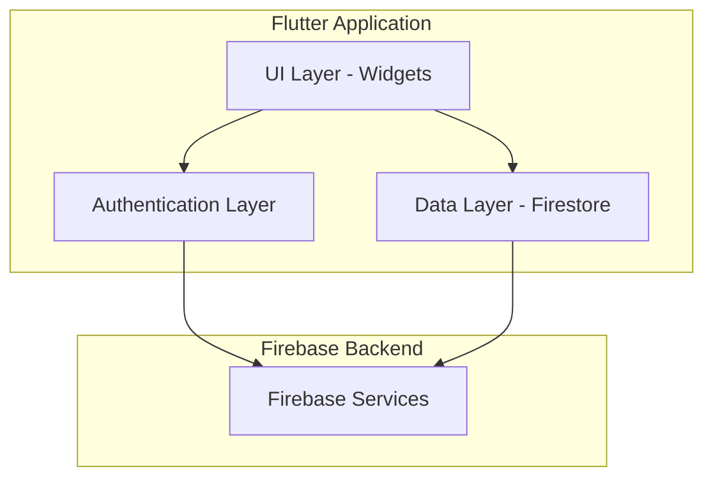

# Design Document

## Overview

NoteAssista is a Flutter mobile application that provides note-taking functionality with Firebase backend integration. The application follows a clean architecture pattern with clear separation between UI, business logic, and data layers. The system leverages Firebase Authentication for user management and Cloud Firestore for real-time data synchronization, ensuring users can access their notes across multiple devices seamlessly.

The application is built using Flutter's widget-based architecture with state management handled through StatefulWidgets and StreamBuilder for reactive UI updates. The design prioritizes simplicity, real-time synchronization, and a responsive user experience.

## Architecture

### High-Level Architecture



### Layer Responsibilities

**UI Layer (Presentation)**
- Renders screens and widgets
- Handles user interactions
- Displays data from Firestore streams
- Manages local UI state (scroll position, form inputs)

**Authentication Layer**
- Manages user registration and login
- Maintains authentication state
- Provides auth context to other layers
- Handles auth state changes

**Data Layer**
- Performs CRUD operations on Firestore
- Structures data queries
- Transforms Firestore documents to app models
- Manages data streams for real-time updates

**Firebase Backend**
- Firebase Authentication: User identity management
- Cloud Firestore: NoSQL database for note storage
- Real-time synchronization across devices

## Components and Interfaces

### Screen Components

**1. AuthWrapper**
- Purpose: Root-level authentication state manager
- Responsibilities:
  - Listen to Firebase auth state stream
  - Route to Login/Signup or Home based on auth state
  - Initialize Firebase on app startup
- Key Methods:
  - `build()`: Returns StreamBuilder listening to auth state changes

**2. LoginScreen**
- Purpose: User authentication interface
- Responsibilities:
  - Display login form (email, password)
  - Handle login submission
  - Navigate to signup screen
  - Display error messages
- Key Methods:
  - `_login()`: Authenticate user with Firebase
  - `_navigateToSignup()`: Switch to signup screen
- State: Email, password, error message

**3. SignupScreen**
- Purpose: New user registration interface
- Responsibilities:
  - Display signup form (email, password, confirm password)
  - Validate password match
  - Create user account in Firebase Auth
  - Create user document in Firestore
  - Auto-login after successful registration
- Key Methods:
  - `_signup()`: Create new user account
  - `_validatePasswords()`: Check password confirmation match
- State: Email, password, confirmPassword, error message

**4. HomeScreen**
- Purpose: Main note display and management interface
- Responsibilities:
  - Display notes in two sections (not done, done)
  - Stream notes from Firestore in real-time
  - Handle scroll-based FAB visibility
  - Navigate to add/edit note screens
  - Trigger note deletion
- Key Methods:
  - `_streamNotes()`: Return Firestore snapshot stream
  - `_deleteNote(noteId)`: Remove note from Firestore
  - `_toggleNoteStatus(noteId, currentStatus)`: Update isDone field
  - `_handleScroll()`: Show/hide FAB based on scroll direction
- State: ScrollController, FAB visibility, user ID

**5. AddNoteScreen**
- Purpose: Note creation interface
- Responsibilities:
  - Display form for title, description, category selection
  - Validate input fields
  - Create new note document in Firestore
  - Generate timestamp
  - Navigate back to home on success
- Key Methods:
  - `_createNote()`: Add note to Firestore
  - `_selectCategory(index)`: Update selected category image
  - `_generateTimestamp()`: Format current time as HH:mm
- State: Title, description, selectedCategoryIndex

**6. EditNoteScreen**
- Purpose: Note modification interface
- Responsibilities:
  - Pre-populate form with existing note data
  - Allow modification of title, description, category
  - Update note document in Firestore
  - Refresh timestamp on update
  - Preserve note ID and completion status
- Key Methods:
  - `_updateNote()`: Update Firestore document
  - `_selectCategory(index)`: Change category image
  - `_generateTimestamp()`: Format current time as HH:mm
- State: Title, description, selectedCategoryIndex, noteId, isDone

### Data Models

**User Model**
```dart
class UserModel {
  final String uid;
  final String email;
  
  UserModel({
    required this.uid,
    required this.email,
  });
  
  Map<String, dynamic> toMap() {
    return {
      'uid': uid,
      'email': email,
    };
  }
  
  factory UserModel.fromFirebaseUser(User user) {
    return UserModel(
      uid: user.uid,
      email: user.email ?? '',
    );
  }
}
```

**Note Model**
```dart
class NoteModel {
  final String id;
  final String title;
  final String description;
  final String timestamp;
  final int categoryImageIndex;
  final bool isDone;
  final bool isPinned;
  final List<String> tags;
  final DateTime createdAt;
  final DateTime updatedAt;
  
  NoteModel({
    required this.id,
    required this.title,
    required this.description,
    required this.timestamp,
    required this.categoryImageIndex,
    required this.isDone,
    this.isPinned = false,
    this.tags = const [],
    required this.createdAt,
    required this.updatedAt,
  });
  
  Map<String, dynamic> toMap() {
    return {
      'title': title,
      'description': description,
      'timestamp': timestamp,
      'categoryImageIndex': categoryImageIndex,
      'isDone': isDone,
      'isPinned': isPinned,
      'tags': tags,
      'createdAt': createdAt.toIso8601String(),
      'updatedAt': updatedAt.toIso8601String(),
    };
  }
  
  factory NoteModel.fromFirestore(DocumentSnapshot doc) {
    Map<String, dynamic> data = doc.data() as Map<String, dynamic>;
    return NoteModel(
      id: doc.id,
      title: data['title'] ?? '',
      description: data['description'] ?? '',
      timestamp: data['timestamp'] ?? '',
      categoryImageIndex: data['categoryImageIndex'] ?? 0,
      isDone: data['isDone'] ?? false,
      isPinned: data['isPinned'] ?? false,
      tags: List<String>.from(data['tags'] ?? []),
      createdAt: data['createdAt'] != null 
          ? DateTime.parse(data['createdAt']) 
          : DateTime.now(),
      updatedAt: data['updatedAt'] != null 
          ? DateTime.parse(data['updatedAt']) 
          : DateTime.now(),
    );
  }
}
```

### Service Interfaces

**AuthService**
- Purpose: Encapsulate Firebase Authentication operations
- Methods:
  - `Stream<User?> get authStateChanges`: Stream of auth state
  - `Future<UserCredential> signUp(String email, String password)`: Create account
  - `Future<UserCredential> signIn(String email, String password)`: Login
  - `Future<void> signOut()`: Logout
  - `User? get currentUser`: Get current authenticated user

**FirestoreService**
- Purpose: Encapsulate Cloud Firestore operations
- Methods:
  - `Future<void> createUser(String uid, String email)`: Create user document
  - `Future<void> createNote(String userId, NoteModel note)`: Add note
  - `Future<void> updateNote(String userId, String noteId, NoteModel note)`: Update note
  - `Future<void> deleteNote(String userId, String noteId)`: Remove note
  - `Stream<QuerySnapshot> streamNotes(String userId, bool isDone)`: Stream notes by status
  - `Future<void> toggleNoteStatus(String userId, String noteId, bool newStatus)`: Update isDone

## Data Models

### Firestore Data Structure

```
users (collection)
  └── {userId} (document)
      ├── uid: string
      ├── email: string
      └── notes (subcollection)
          └── {noteId} (document)
              ├── title: string
              ├── description: string
              ├── timestamp: string (HH:mm format)
              ├── categoryImageIndex: number (0-3)
              └── isDone: boolean
```

### Category Images

The application provides 4 predefined category images stored as asset references:
- Index 0: Category image 1
- Index 1: Category image 2
- Index 2: Category image 3
- Index 3: Category image 4

Images are stored in `assets/images/` directory and referenced by index in the note model.

## Error Handling

### Authentication Errors

**Firebase Auth Exceptions**
- `weak-password`: Display "Password should be at least 6 characters"
- `email-already-in-use`: Display "An account already exists with this email"
- `user-not-found`: Display "No user found with this email"
- `wrong-password`: Display "Incorrect password"
- `invalid-email`: Display "Please enter a valid email address"
- `network-request-failed`: Display "Network error. Please check your connection"

**Error Display Strategy**
- Show error messages in SnackBar or below form fields
- Clear errors when user modifies input
- Provide actionable error messages

### Firestore Errors

**Common Firestore Exceptions**
- `permission-denied`: Display "You don't have permission to perform this action"
- `unavailable`: Display "Service temporarily unavailable. Please try again"
- `not-found`: Display "The requested item was not found"

**Error Handling Strategy**
- Wrap Firestore operations in try-catch blocks
- Display user-friendly error messages
- Log detailed errors for debugging
- Gracefully degrade functionality when offline

### UI Error States

**Loading States**
- Show CircularProgressIndicator during async operations
- Disable buttons during submission to prevent duplicate requests
- Display skeleton screens while loading note lists

**Empty States**
- Display "No notes yet" message when note list is empty
- Provide call-to-action to create first note
- Show separate empty states for "Not Done" and "Done" sections

## Testing Strategy

### Unit Tests

**Authentication Logic**
- Test email validation
- Test password confirmation matching
- Test error message formatting
- Mock Firebase Auth responses

**Data Transformation**
- Test NoteModel.fromFirestore() with various inputs
- Test NoteModel.toMap() serialization
- Test timestamp generation format
- Test UserModel transformations

**Business Logic**
- Test note filtering by isDone status
- Test category image index validation (0-3 range)
- Test scroll direction detection for FAB visibility

### Widget Tests

**Screen Rendering**
- Test LoginScreen displays email and password fields
- Test SignupScreen displays confirmation field
- Test HomeScreen renders note sections correctly
- Test AddNoteScreen displays category selection
- Test EditNoteScreen pre-populates with note data

**User Interactions**
- Test form submission triggers appropriate methods
- Test navigation between screens
- Test note deletion confirmation
- Test category image selection updates state
- Test completion toggle updates UI

**Stream Handling**
- Test StreamBuilder rebuilds on auth state changes
- Test note list updates when Firestore data changes
- Test error states display correctly

### Integration Tests

**End-to-End Flows**
- Test complete signup → login → create note → view note flow
- Test edit note → update → verify changes flow
- Test mark note complete → verify section change flow
- Test delete note → verify removal flow
- Test logout → login → verify notes persist flow

**Firebase Integration**
- Test actual Firebase Auth operations in test environment
- Test Firestore CRUD operations with test database
- Test real-time synchronization across multiple instances
- Test offline behavior and data persistence

### Testing Tools

- `flutter_test`: Core testing framework
- `mockito`: Mock Firebase services for unit tests
- `integration_test`: End-to-end testing
- `fake_cloud_firestore`: Mock Firestore for testing
- `firebase_auth_mocks`: Mock Firebase Auth for testing

## UI/UX Design Considerations

### Visual Design

**Color Scheme**
- Primary color: Consistent brand color for buttons and accents
- Background: Light/neutral for readability
- Category images: Distinct colors for visual categorization
- Completion status: Visual distinction between done/not done sections

**Typography**
- Title: Bold, larger font for note titles
- Description: Regular weight, readable size
- Timestamp: Smaller, muted color
- Form labels: Clear, accessible sizing

### Interaction Design

**Floating Action Button (FAB)**
- Position: Bottom-right corner
- Behavior: Hide on scroll down, show on scroll up
- Action: Navigate to AddNoteScreen
- Icon: Plus/add icon

**Note Cards**
- Display: Title, description, timestamp, category image
- Actions: Tap to edit, swipe or icon to delete, checkbox to toggle completion
- Layout: Card-based design with elevation/shadow

**Forms**
- Input validation: Real-time feedback on errors
- Focus states: Highlighted borders on active fields
- Submit buttons: Disabled state during processing
- Category selection: Visual grid with selection indicator

### Accessibility

- Semantic labels for screen readers
- Sufficient color contrast ratios
- Touch targets minimum 48x48 dp
- Keyboard navigation support
- Error messages announced to screen readers

## Performance Considerations

### Firestore Optimization

**Query Efficiency**
- Index notes by isDone field for fast filtering
- Limit initial query results if note count grows large
- Use pagination for large note collections

**Real-time Listeners**
- Detach listeners when screens are disposed
- Use single listener per screen to avoid duplicate subscriptions
- Implement listener cleanup in dispose() methods

### UI Performance

**List Rendering**
- Use ListView.builder for efficient rendering of large lists
- Implement item recycling for smooth scrolling
- Avoid rebuilding entire list on single item change

**Image Loading**
- Preload category images at app startup
- Use cached network images if images are remote
- Optimize image sizes for mobile displays

### State Management

**Minimal Rebuilds**
- Use StreamBuilder only where real-time updates are needed
- Implement shouldRebuild logic to prevent unnecessary renders
- Scope setState() calls to minimal widget subtrees

## Security Considerations

### Firestore Security Rules

```javascript
rules_version = '2';
service cloud.firestore {
  match /databases/{database}/documents {
    match /users/{userId} {
      allow read, write: if request.auth != null && request.auth.uid == userId;
      
      match /notes/{noteId} {
        allow read, write: if request.auth != null && request.auth.uid == userId;
      }
    }
  }
}
```

**Rule Explanation**
- Users can only access their own user document
- Users can only read/write notes in their own subcollection
- All operations require authentication
- No public read/write access

### Authentication Security

**Password Requirements**
- Minimum 6 characters (Firebase default)
- Password confirmation required during signup
- Passwords never stored in app state after authentication

**Session Management**
- Firebase handles token refresh automatically
- Sessions persist across app restarts
- Logout clears all local auth state

### Data Validation

**Client-Side Validation**
- Validate email format before submission
- Ensure required fields are not empty
- Validate category index is within valid range (0-3)

**Server-Side Validation**
- Firestore security rules enforce data structure
- Type validation through Firestore schema
- Prevent unauthorized data access through rules

## Deployment and Configuration

### Firebase Setup

**Required Firebase Services**
- Firebase Authentication (Email/Password provider enabled)
- Cloud Firestore (Database created)
- Firebase project configuration for Android and iOS

**Configuration Files**
- Android: `google-services.json` in `android/app/`
- iOS: `GoogleService-Info.plist` in `ios/Runner/`
- Firebase initialization in `main.dart` before runApp()

### Flutter Dependencies

```yaml
dependencies:
  flutter:
    sdk: flutter
  firebase_core: ^latest
  firebase_auth: ^latest
  cloud_firestore: ^latest
```

### Platform-Specific Configuration

**Android**
- Minimum SDK version: 21 (Android 5.0)
- Add Firebase dependencies in `android/app/build.gradle`
- Enable multidex if needed

**iOS**
- Minimum deployment target: iOS 12.0
- Add Firebase SDK through CocoaPods
- Configure Info.plist with required permissions

## Future Enhancements

While not part of the current requirements, these enhancements could be considered for future iterations:

- Search and filter notes by title or description
- Rich text formatting in note descriptions
- Attach images or files to notes
- Share notes with other users
- Organize notes with tags or folders
- Dark mode support
- Offline mode with local caching
- Push notifications for reminders
- Export notes to external formats